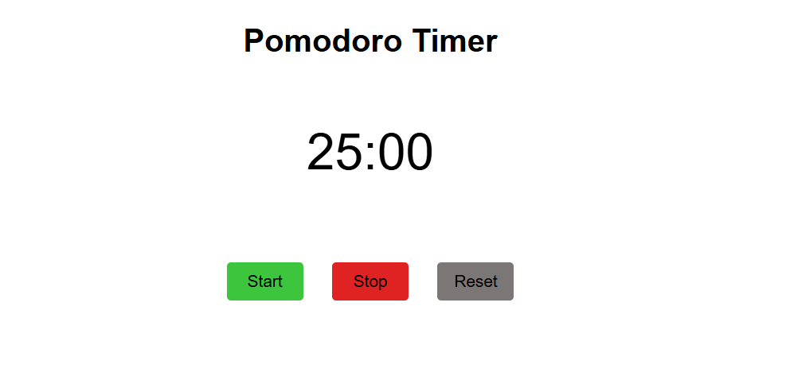

# 🍅 Pomodoro Timer

A responsive Pomodoro Timer built using HTML, CSS, and JavaScript. This application helps users stay focused and productive by following the Pomodoro Technique, which divides work into focused sessions with regular breaks.

## 🌟 Features

- ⏱️ 25-minute countdown timer
- ▶️ Start timer functionality
- ⏸️ Stop/Pause timer functionality
- 🔄 Reset timer functionality
- 📱 Fully responsive design for desktop, tablet, and mobile devices
- 🎨 Clean and modern user interface
- 🚫 Prevents multiple timers from running simultaneously
- ⚡ Lightweight and fast

## 📸 Screenshot



## 🌐 Live Demo

🔗 **Live Website:**  https://hkkohlio7-code.github.io/Pomodoro-timer/

## 🛠️ Built With

- HTML5
- CSS3
- JavaScript (ES6)

## 📂 Project Structure

```text
Pomodoro-Timer/
│
├── index.html
├── style.css
├── script.js
├── screenshot.png
└── README.md
```

## 🚀 Getting Started

To run this project locally:

1. Clone the repository

```bash
git clone https://github.com/your-username/pomodoro-timer.git
```

2. Open the project folder

```bash
cd pomodoro-timer
```

3. Open `index.html` in your browser

## 🎯 How to Use

1. Click the **Start** button to begin the countdown.
2. Click the **Stop** button to pause the timer.
3. Click the **Reset** button to reset the timer back to 25:00.
4. Continue your focused work session until the timer ends.

## 📚 What I Learned

While building this project, I improved my understanding of:

- JavaScript DOM Manipulation
- Event Listeners
- Functions and Variables
- `setInterval()` and `clearInterval()`
- Time Formatting
- Responsive Web Design
- Application State Management

## 🔮 Future Improvements

- Short break and long break modes
- Custom timer durations
- Sound notifications
- Dark mode
- Session tracking
- Local Storage support
- Progress indicator

## 👨‍💻 Author

**Hemant Kohli**

GitHub: https://github.com/hkkohlio7-Code

## 🤝 Contributing

Contributions, issues, and feature requests are welcome.

Feel free to fork the repository and submit a pull request.

## ⭐ Support

If you found this project useful, consider giving it a star on GitHub.

## 📄 License

This project is licensed under the MIT License.